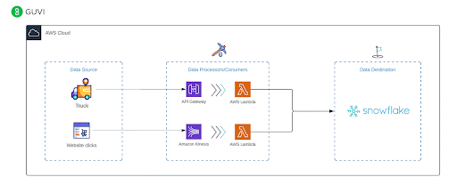

# From-Clicks-to-Deliveries-Maximizing-E-commerce-Performance-with-Real-Time-Data-Integration
## Description :
As an e-commerce company, our success hinges on seamlessly integrating our online platform with efficient logistics management to ensure optimal customer satisfaction and operational efficiency. To achieve this synergy, we aim to leverage real-time data streams from both our website and fleet of delivery trucks.

**Tools used:**
- Python
- Boto3
- API Gateway
- AWS Kinesis
- AWS Lambda Function
- AWS DynamoDB
  
## Online Platform Optimization :
We need to analyze clickstream data to understand customer preferences, enhance user experience, and optimize marketing strategies for key product categories such as mobile phones, laptops, and cameras.

*For 3 items following data is collecting in real time :*

   - Item ID
   - Item Name
   - Click Count

**[All data used here are random and simulated using the Python file [click_producer.py](click_producer.py)]**

## Fleet Management and Logistics Optimization :
Simultaneously, we must monitor and analyze real-time telemetry data from our fleet of delivery trucks, utilizing IoT sensors installed in each vehicle. This data will enable us to optimize routes, reduce fuel consumption, proactively address maintenance issues, and ensure the safety and reliability of our delivery operations.

**For 3 truck in the fleet, the following data will be collected in near real-time(the trucks are sending the data every 1 minute):*?*

- Truck ID : should have 3 truck id’s
- GPS Location: Latitude, Longitude, Altitude, Speed.
- Vehicle Speed: Real-time speed of the vehicle.
- Engine Diagnostics: Engine RPM, Fuel Level, Temperature, Oil Pressure, Battery Voltage.
- Odometer Reading: Total distance traveled.
- Fuel Consumption: Fuel usage over time.
- Vehicle Health and Maintenance: Brake status, Tire pressure, Transmission status.
- Environmental Conditions: Temperature, Humidity, Atmospheric Pressure.

**[All data used here are random and simulated using the Python file [truck.py](truck.py)]**

### Workflow :

- The Clickstream data is collected in realtime using AWS Kinesis and sent to a Lambda function to process and store the data in DynamoDB
- The Truck IOT data is collected once every 1 minute, posted to an API which triggers a Lambda function and stores the data in DynamoDB

